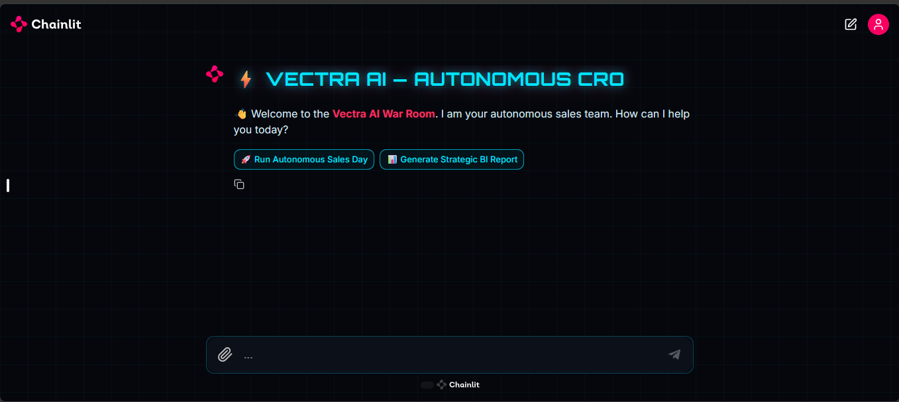

# ⚡ VECTRA AI — Autonomous CRO

**A CRM-native autonomous sales system that qualifies, negotiates, closes, and learns — running entirely on Google Sheets.**

*Build with Gemini XPRIZE 2026 • Category: Small Business Services*

---

## 📖 Overview

Vectra AI is not a chatbot — it is an **autonomous revenue operator**.
A human founder feeds leads into a Google Sheet; from that moment, the
headless Autonomous Pipeline takes over 100% of the sales operation:
qualifying prospects, adapting personality, negotiating within strict
compliance guardrails, logging outcomes, and learning from every deal.

No expensive CRM. No database. No sales team. **Near-zero cost per deal —
entire system runs on free tiers, with DeepSeek reasoning averaging well
under $0.01 per closed deal.**



## 🧬 The 4 Signature Capabilities

| # | Capability | What it does |
|---|------------|--------------|
| 1 | **Memory-Aware Negotiation** | CRM-native long-term memory — the AI greets returning leads with full context ("Last time we discussed…") |
| 2 | **Outcome Learning** | Deterministic strategy classifier + win-rate analytics; the Closer automatically prefers historically winning strategies |
| 3 | **Adaptive Personality Engine** | Detects DRIVER / ANALYTICAL / AMIABLE / EXPRESSIVE leads and adapts tone in real time |
| 4 | **Strategic BI (CRO Mode)** | DeepSeek acts as Chief Revenue Officer, writing 3-paragraph strategic reports from live CRM data |

## 🏗️ Ultra-Lean Hybrid Architecture (95/5)

- **DeepSeek V4 Flash (95%)** — all reasoning: routing, qualification, negotiation, memory synthesis, CRO reports
- **Gemini 3.5 Flash Lite (5%)** — ONLY the Finance Guardrail compliance audit (discount ≤ 10%, no false promises, self-correction loop)
- **Google Sheets** — the CRM database (Lead Pipeline, CRM Log, Lead Memory, Strategy Stats)
- **Deterministic Python** — strategy detection, personality heuristics, stats aggregation (zero LLM cost)

```
Lead (Sheets / Chat) → Manager Agent (Router)
   → SDR Agent (Qualify)  /  CLOSER Agent (Negotiate)
        → Finance Guardrail (Gemini audit + self-correction)
             → Zero-Click Execution (Google Sheets logging)
                  → Strategy Stats + Lead Memory (learning loop)
```

## 🗂️ Repository Structure

```
backend/chainlit_app.py    # Glass-Box UI + headless Autonomous Pipeline
services/llm_service.py    # Hybrid LLM layer + Finance Guardrail
public/                    # Neon Cyberpunk theme (CSS, SVG, JS branding)
.chainlit/config.toml      # Theme & custom asset configuration
knowledge_base.txt         # Local RAG context (anti-hallucination)
engine.py                  # Terminal test harness
requirements.txt
```

## 🚀 Quick Start

**Prerequisites:** Python 3.10+, a Fireworks AI API key, a Google Gemini API key, and a Google Service Account JSON.

```bash
git clone https://github.com/chelseaeleonora/vectra-ai-agent.git
cd vectra-ai-agent
python -m venv venv && source venv/bin/activate   # Windows: venv\Scripts\activate
pip install -r requirements.txt
```

Create `.env`:
```
FIREWORKS_API_KEY=your_key
GEMINI_API_KEY=your_key
```

Place your Service Account file as `sheets_credentials.json` in the root
(or set `GOOGLE_CREDENTIALS_JSON` env var for cloud deployment).

Run:
```bash
chainlit run backend/chainlit_app.py
```
Then click **🚀 Run Autonomous Sales Day** to process all `NEW` leads in your
Lead Pipeline tab — headlessly, with zero human intervention.

## ☁️ Deployment (Render / Railway)

- **Build:** `pip install -r requirements.txt`
- **Start:** `chainlit run backend/chainlit_app.py --host 0.0.0.0 --port $PORT --headless`
- **Env vars:** `FIREWORKS_API_KEY`, `GEMINI_API_KEY`, `GOOGLE_CREDENTIALS_JSON`

## 💰 Unit Economics

| Item | Cost |
|------|------|
| Server / database | **$0** (Google Sheets free tier) |
| Gemini guardrail | **$0** (Google AI Studio free tier) |
| DeepSeek reasoning | **< $0.01/deal** (estimated upper bound, varies by conversation length) |
| Monthly infrastructure | **$0** (entire system runs on free tiers by design) |

## ⚖️ What This Is — and Is Not

**Is:** a production-grade, auditable sales-automation template you customize
(knowledge base, prompts, business rules) for any product or service.
**Is not:** a lead generator, payment processor, or email sender. Buyers provide
their own leads, payment links, and delivery automation.

## License

MIT — learn, modify, deploy.
